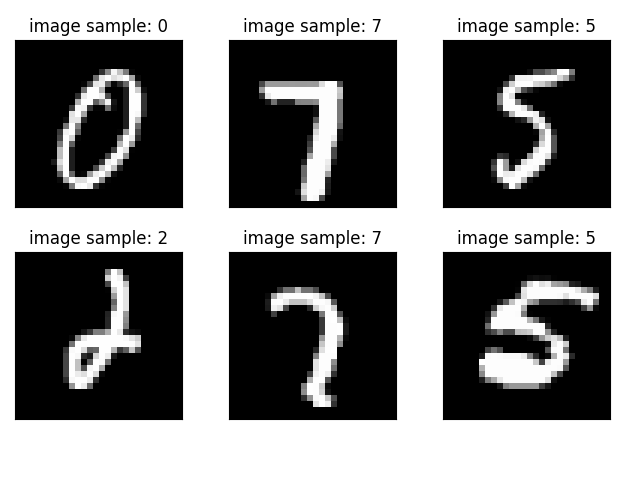
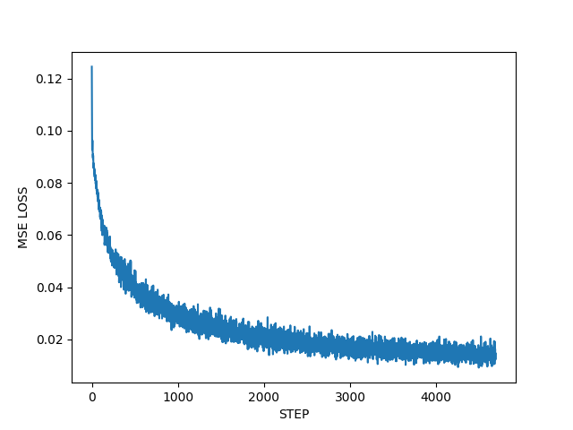
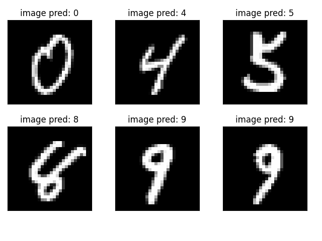

# 基于Pytorch的简单神经网络调用程序

### 使用说明

**pip install -r requirements.txt**

### 功能
实现简单的手写数字识别，准确率约为95%

### 可执行文件

**app.py**

### 控制台运行
1. 使用全连接神经网络运行：
**python app.py -m Net**

2. 使用卷积神经网络运行：
**python app.py -m CNN**

### 输出
1. 训练集数据展示

2. 训练中损失展示

3. 训练后模型预测展示

4. 训练损失数据保存

data.json -> key = "loss"

5. 预测准确率数据保存

data.json -> key = "acc"

___

### 特别说明

1. 程序中的网络结构与网络参数未经过优化,使用前请自行调优。

2. 程序中的图片数据集为MINIST数据集,如果使用其他数据集或者其他图像尺寸,请自行修改网络结构。

3. 考虑到部分使用者没有合适的显卡,batch_size可根据显存性能自行增加或者减小。

4. 程序中使用的优化器,目标函数不唯一,根据需求修改。

